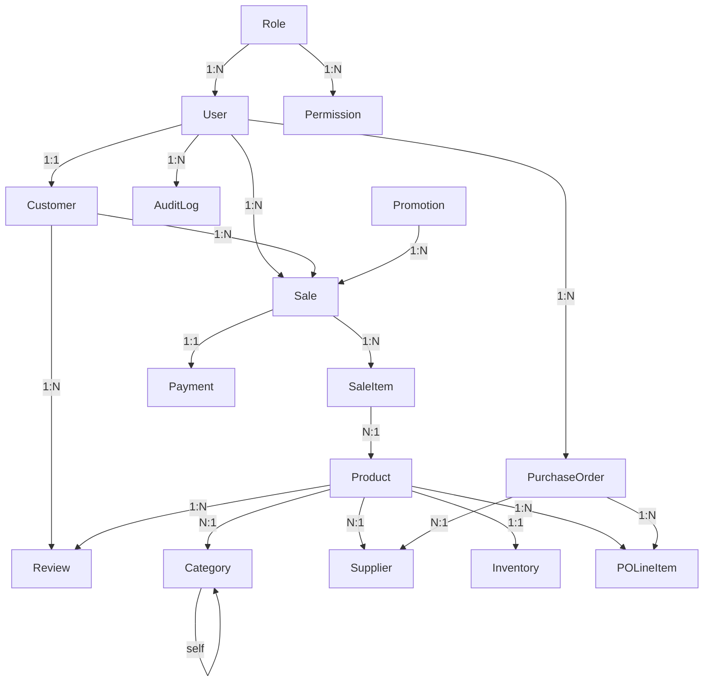

# Design Document: SmartPOS+ Database Schema

## Overview

This document describes the complete database schema design for SmartPOS+, a Blazor Server (.NET 10) point-of-sale application. The design covers 16 EF Core model classes, a shared enums file (`Contracts.cs`), and a fully configured `AppDbContext`. Four legacy audit log models (`AdminLog`, `CashierLog`, `CustomerLog`, `ManagerAction`) are replaced by a single unified `AuditLog` model.

All model classes follow the existing project conventions:
- `partial class` pattern
- `virtual` keyword on all navigation properties
- Required navigation properties initialized with `= null!`
- Collection navigation properties initialized with `= new List<T>()`
- All Fluent API configuration lives in `AppDbContext.OnModelCreating`

The connection string is registered in `Program.cs` via `appsettings.json`; the `OnConfiguring` override is removed from `AppDbContext`.

---

## Architecture



---

## Components and Interfaces

### File Layout

| File | Location | Purpose |
|------|----------|---------|
| `Contracts.cs` | `SmartPOS/` (project root) | Shared enums namespace `SmartPOS.Shared.Enums` |
| `Role.cs` | `SmartPOS/Models/` | Role entity |
| `Permission.cs` | `SmartPOS/Models/` | Per-role module permissions |
| `User.cs` | `SmartPOS/Models/` | Application user |
| `Customer.cs` | `SmartPOS/Models/` | Customer profile (1:1 with User) |
| `AuditLog.cs` | `SmartPOS/Models/` | Unified audit log |
| `Promotion.cs` | `SmartPOS/Models/` | Discount promotions |
| `Category.cs` | `SmartPOS/Models/` | Product categories (self-ref hierarchy) |
| `Supplier.cs` | `SmartPOS/Models/` | Supplier contact info |
| `Product.cs` | `SmartPOS/Models/` | Product catalog |
| `Sale.cs` | `SmartPOS/Models/` | Sales transaction header |
| `SaleItem.cs` | `SmartPOS/Models/` | Sale line items |
| `Review.cs` | `SmartPOS/Models/` | Customer product reviews |
| `Inventory.cs` | `SmartPOS/Models/` | Stock levels (1:1 with Product) |
| `PurchaseOrder.cs` | `SmartPOS/Models/` | Supplier purchase order header |
| `POLineItem.cs` | `SmartPOS/Models/` | Purchase order line items |
| `Payment.cs` | `SmartPOS/Models/` | Payment record (1:1 with Sale) |
| `AppDbContext.cs` | `SmartPOS/Data/` | EF Core DbContext |

### Files to Delete

- `SmartPOS/Models/AdminLog.cs`
- `SmartPOS/Models/CashierLog.cs`
- `SmartPOS/Models/CustomerLog.cs`
- `SmartPOS/Models/ManagerAction.cs`

---

## Data Models

### Contracts.cs — Shared Enums

```csharp
namespace SmartPOS.Shared.Enums;

public enum DiscountType
{
    Percentage = 0,
    Flat = 1
}

public enum SaleType
{
    Onsite = 0,
    Online = 1
}

public enum SaleStatus
{
    Completed = 0,
    Voided = 1,
    Refunded = 2
}

public enum POStatus
{
    Draft = 0,
    Sent = 1,
    Received = 2,
    Cancelled = 3
}

public enum PaymentMethod
{
    Cash = 0,
    Card = 1,
    Online = 2
}

public enum PaymentStatus
{
    Pending = 0,
    Completed = 1,
    Failed = 2,
    Refunded = 3
}
```

### Role.cs

```csharp
using System.Collections.Generic;

namespace SmartPOS.Models;

public partial class Role
{
    public int Id { get; set; }
    public string Name { get; set; } = null!;

    public virtual ICollection<User> Users { get; set; } = new List<User>();
    public virtual ICollection<Permission> Permissions { get; set; } = new List<Permission>();
}
```

**Fluent API (in AppDbContext):**
- `Id` → PK, auto-increment (convention)
- `Name` → `HasMaxLength(50)`, `IsRequired()`

---

### Permission.cs

```csharp
using System.Collections.Generic;

namespace SmartPOS.Models;

public partial class Permission
{
    public int Id { get; set; }
    public int RoleId { get; set; }
    public string Module { get; set; } = null!;
    public bool CanCreate { get; set; }
    public bool CanRead { get; set; }
    public bool CanUpdate { get; set; }
    public bool CanDelete { get; set; }

    public virtual Role Role { get; set; } = null!;
}
```

**Fluent API:**
- `RoleId` → `HasIndex("IX_Permissions_RoleId")`
- `Module` → `HasMaxLength(100)`, `IsRequired()`
- `CanCreate/CanRead/CanUpdate/CanDelete` → `HasDefaultValue(false)`
- `Role` → `HasForeignKey(p => p.RoleId)`, `WithMany(r => r.Permissions)`

---

### User.cs

```csharp
using System;
using System.Collections.Generic;

namespace SmartPOS.Models;

public partial class User
{
    public int Id { get; set; }
    public string Name { get; set; } = null!;
    public string Email { get; set; } = null!;
    public string PasswordHash { get; set; } = null!;
    public int RoleId { get; set; }
    public bool IsActive { get; set; }
    public DateTime CreatedAt { get; set; }

    public virtual Role Role { get; set; } = null!;
    public virtual Customer? Customer { get; set; }
    public virtual ICollection<Sale> Sales { get; set; } = new List<Sale>();
    public virtual ICollection<PurchaseOrder> PurchaseOrders { get; set; } = new List<PurchaseOrder>();
    public virtual ICollection<AuditLog> AuditLogs { get; set; } = new List<AuditLog>();
}
```

**Fluent API:**
- `Name` → `HasMaxLength(100)`, `IsRequired()`
- `Email` → `HasMaxLength(150)`, `IsRequired()`, `HasIndex("IX_Users_Email").IsUnique()`
- `PasswordHash` → `HasMaxLength(255)`, `IsRequired()`
- `RoleId` → `HasIndex("IX_Users_RoleId")`
- `IsActive` → `HasDefaultValue(true)`
- `CreatedAt` → `HasDefaultValueSql("(getutcdate())")`

---

### Customer.cs

```csharp
using System;
using System.Collections.Generic;

namespace SmartPOS.Models;

public partial class Customer
{
    public int Id { get; set; }
    public int UserId { get; set; }
    public string Name { get; set; } = null!;
    public string Email { get; set; } = null!;
    public string? Phone { get; set; }
    public DateOnly? DateOfBirth { get; set; }
    public string? Address { get; set; }
    public int LoyaltyPoints { get; set; }
    public decimal TotalSpent { get; set; }
    public DateTime CreatedAt { get; set; }

    public virtual User User { get; set; } = null!;
    public virtual ICollection<Sale> Sales { get; set; } = new List<Sale>();
    public virtual ICollection<Review> Reviews { get; set; } = new List<Review>();
}
```

**Fluent API:**
- `UserId` → `HasIndex("IX_Customers_UserId").IsUnique()` (one-to-one with User)
- `Name` → `HasMaxLength(100)`, `IsRequired()`
- `Email` → `HasMaxLength(150)`, `IsRequired()`, `HasIndex("IX_Customers_Email").IsUnique()`
- `Phone` → `HasMaxLength(20)`
- `Address` → `HasColumnType("text")`
- `LoyaltyPoints` → `HasDefaultValue(0)`
- `TotalSpent` → `HasPrecision(10, 2)`, `HasDefaultValue(0.00m)`
- `CreatedAt` → `HasDefaultValueSql("(getutcdate())")`
- One-to-one: `HasOne(c => c.User).WithOne(u => u.Customer).HasForeignKey<Customer>(c => c.UserId)`

---

### AuditLog.cs

```csharp
using System;

namespace SmartPOS.Models;

public partial class AuditLog
{
    public int Id { get; set; }
    public int UserId { get; set; }
    public string Action { get; set; } = null!;
    public string Module { get; set; } = null!;
    public DateTime Timestamp { get; set; }
    public string? IPAddress { get; set; }
    public string? Details { get; set; }

    public virtual User User { get; set; } = null!;
}
```

**Fluent API:**
- `UserId` → `HasIndex("IX_AuditLogs_UserId")`
- `Action` → `HasMaxLength(255)`, `IsRequired()`
- `Module` → `HasMaxLength(100)`, `IsRequired()`
- `Timestamp` → `HasDefaultValueSql("(getutcdate())")`
- `IPAddress` → `HasMaxLength(45)`
- `Details` → `HasColumnType("text")`

---

### Promotion.cs

```csharp
using System;
using System.Collections.Generic;
using SmartPOS.Shared.Enums;

namespace SmartPOS.Models;

public partial class Promotion
{
    public int Id { get; set; }
    public string Code { get; set; } = null!;
    public DiscountType DiscountType { get; set; }
    public decimal Value { get; set; }
    public decimal MinOrderValue { get; set; }
    public int? MaxUsageLimit { get; set; }
    public int UsageCount { get; set; }
    public DateOnly ValidFrom { get; set; }
    public DateOnly ValidTo { get; set; }
    public bool IsActive { get; set; }

    public virtual ICollection<Sale> Sales { get; set; } = new List<Sale>();
}
```

**Fluent API:**
- `Code` → `HasMaxLength(50)`, `IsRequired()`, `HasIndex("IX_Promotions_Code").IsUnique()`
- `Value` → `HasPrecision(10, 2)`
- `MinOrderValue` → `HasPrecision(10, 2)`, `HasDefaultValue(0.00m)`
- `UsageCount` → `HasDefaultValue(0)`
- `IsActive` → `HasDefaultValue(true)`

---

### Category.cs

```csharp
using System.Collections.Generic;

namespace SmartPOS.Models;

public partial class Category
{
    public int Id { get; set; }
    public string Name { get; set; } = null!;
    public int? ParentCategoryId { get; set; }
    public string? Description { get; set; }
    public string? ImageURL { get; set; }

    public virtual Category? ParentCategory { get; set; }
    public virtual ICollection<Category> SubCategories { get; set; } = new List<Category>();
    public virtual ICollection<Product> Products { get; set; } = new List<Product>();
}
```

**Fluent API:**
- `Name` → `HasMaxLength(100)`, `IsRequired()`
- `Description` → `HasColumnType("text")`
- `ImageURL` → `HasMaxLength(255)`
- Self-ref: `HasOne(c => c.ParentCategory).WithMany(c => c.SubCategories).HasForeignKey(c => c.ParentCategoryId).OnDelete(DeleteBehavior.NoAction)`

---

### Supplier.cs

```csharp
using System.Collections.Generic;

namespace SmartPOS.Models;

public partial class Supplier
{
    public int Id { get; set; }
    public string Name { get; set; } = null!;
    public string? ContactPerson { get; set; }
    public string? ContactNo { get; set; }
    public string? Email { get; set; }
    public string? Address { get; set; }
    public bool IsActive { get; set; }

    public virtual ICollection<Product> Products { get; set; } = new List<Product>();
    public virtual ICollection<PurchaseOrder> PurchaseOrders { get; set; } = new List<PurchaseOrder>();
}
```

**Fluent API:**
- `Name` → `HasMaxLength(100)`, `IsRequired()`
- `ContactPerson` → `HasMaxLength(100)`
- `ContactNo` → `HasMaxLength(20)`
- `Email` → `HasMaxLength(150)`, `HasIndex("IX_Suppliers_Email").IsUnique()`
- `Address` → `HasColumnType("text")`
- `IsActive` → `HasDefaultValue(true)`

---

### Product.cs

```csharp
using System;
using System.Collections.Generic;

namespace SmartPOS.Models;

public partial class Product
{
    public int Id { get; set; }
    public string Name { get; set; } = null!;
    public string SKU { get; set; } = null!;
    public string? Description { get; set; }
    public string? ImageURL { get; set; }
    public decimal Price { get; set; }
    public decimal CostPrice { get; set; }
    public bool IsActive { get; set; }
    public int CategoryId { get; set; }
    public int? SupplierId { get; set; }
    public DateTime CreatedAt { get; set; }

    public virtual Category Category { get; set; } = null!;
    public virtual Supplier? Supplier { get; set; }
    public virtual Inventory? Inventory { get; set; }
    public virtual ICollection<SaleItem> SaleItems { get; set; } = new List<SaleItem>();
    public virtual ICollection<POLineItem> POLineItems { get; set; } = new List<POLineItem>();
    public virtual ICollection<Review> Reviews { get; set; } = new List<Review>();
}
```

**Fluent API:**
- `Name` → `HasMaxLength(150)`, `IsRequired()`
- `SKU` → `HasMaxLength(50)`, `IsRequired()`, `HasIndex("IX_Products_SKU").IsUnique()`
- `Description` → `HasColumnType("text")`
- `ImageURL` → `HasMaxLength(255)`
- `Price` → `HasPrecision(10, 2)`
- `CostPrice` → `HasPrecision(10, 2)`
- `IsActive` → `HasDefaultValue(true)`
- `CreatedAt` → `HasDefaultValueSql("(getutcdate())")`
- `Category` FK → `OnDelete(DeleteBehavior.Restrict)`
- `Supplier` FK → `IsRequired(false)`, `OnDelete(DeleteBehavior.SetNull)`

---

### Sale.cs

```csharp
using System;
using System.Collections.Generic;
using SmartPOS.Shared.Enums;

namespace SmartPOS.Models;

public partial class Sale
{
    public int Id { get; set; }
    public int? CustomerId { get; set; }
    public int UserId { get; set; }
    public int? PromoId { get; set; }
    public SaleType SaleType { get; set; }
    public decimal TotalAmount { get; set; }
    public decimal DiscountAmount { get; set; }
    public decimal TaxAmount { get; set; }
    public DateTime SaleDate { get; set; }
    public SaleStatus Status { get; set; }

    public virtual Customer? Customer { get; set; }
    public virtual User User { get; set; } = null!;
    public virtual Promotion? Promotion { get; set; }
    public virtual ICollection<SaleItem> SaleItems { get; set; } = new List<SaleItem>();
    public virtual Payment? Payment { get; set; }
}
```

**Fluent API:**
- `TotalAmount` → `HasPrecision(10, 2)`
- `DiscountAmount` → `HasPrecision(10, 2)`, `HasDefaultValue(0.00m)`
- `TaxAmount` → `HasPrecision(10, 2)`
- `SaleDate` → `HasDefaultValueSql("(getutcdate())")`
- `Status` → `HasDefaultValue(SaleStatus.Completed)`
- `CustomerId` → `IsRequired(false)`
- `PromoId` → `IsRequired(false)`

---

### SaleItem.cs

```csharp
namespace SmartPOS.Models;

public partial class SaleItem
{
    public int Id { get; set; }
    public int SaleId { get; set; }
    public int ProductId { get; set; }
    public int Quantity { get; set; }
    public decimal UnitPrice { get; set; }
    public decimal LineTotal { get; set; }

    public virtual Sale Sale { get; set; } = null!;
    public virtual Product Product { get; set; } = null!;
}
```

**Fluent API:**
- `SaleId` → `HasIndex("IX_SaleItems_SaleId")`
- `UnitPrice` → `HasPrecision(10, 2)`
- `LineTotal` → `HasPrecision(10, 2)`
- `Sale` FK → `OnDelete(DeleteBehavior.Cascade)`
- `Product` FK → `OnDelete(DeleteBehavior.Restrict)`

---

### Review.cs

```csharp
using System;

namespace SmartPOS.Models;

public partial class Review
{
    public int Id { get; set; }
    public int CustomerId { get; set; }
    public int ProductId { get; set; }
    public int Rating { get; set; }
    public string? Comment { get; set; }
    public string? Sentiment { get; set; }
    public double? SentimentScore { get; set; }
    public DateTime CreatedAt { get; set; }

    public virtual Customer Customer { get; set; } = null!;
    public virtual Product Product { get; set; } = null!;
}
```

**Fluent API:**
- `Comment` → `HasColumnType("text")`
- `Sentiment` → `HasMaxLength(20)`
- `CreatedAt` → `HasDefaultValueSql("(getutcdate())")`
- CHECK constraint: `HasCheckConstraint("CK_Review_Rating", "[Rating] >= 1 AND [Rating] <= 5")`

---

### Inventory.cs

```csharp
using System;

namespace SmartPOS.Models;

public partial class Inventory
{
    public int Id { get; set; }
    public int ProductId { get; set; }
    public int Quantity { get; set; }
    public int ReorderLevel { get; set; }
    public DateTime LastUpdated { get; set; }

    public virtual Product Product { get; set; } = null!;
}
```

**Fluent API:**
- `ProductId` → `HasIndex("IX_Inventories_ProductId").IsUnique()`
- `Quantity` → `HasDefaultValue(0)`
- `LastUpdated` → `HasDefaultValueSql("(getutcdate())")`
- One-to-one: `HasOne(i => i.Product).WithOne(p => p.Inventory).HasForeignKey<Inventory>(i => i.ProductId)`

---

### PurchaseOrder.cs

```csharp
using System;
using System.Collections.Generic;
using SmartPOS.Shared.Enums;

namespace SmartPOS.Models;

public partial class PurchaseOrder
{
    public int Id { get; set; }
    public int SupplierId { get; set; }
    public int UserId { get; set; }
    public POStatus Status { get; set; }
    public decimal TotalCost { get; set; }
    public DateTime OrderDate { get; set; }
    public DateTime? ReceivedAt { get; set; }
    public string? Notes { get; set; }

    public virtual Supplier Supplier { get; set; } = null!;
    public virtual User User { get; set; } = null!;
    public virtual ICollection<POLineItem> LineItems { get; set; } = new List<POLineItem>();
}
```

**Fluent API:**
- `TotalCost` → `HasPrecision(10, 2)`
- `OrderDate` → `HasDefaultValueSql("(getutcdate())")`
- `Status` → `HasDefaultValue(POStatus.Draft)`
- `Notes` → `HasColumnType("text")`

---

### POLineItem.cs

```csharp
namespace SmartPOS.Models;

public partial class POLineItem
{
    public int Id { get; set; }
    public int POID { get; set; }
    public int ProductId { get; set; }
    public int OrderedQty { get; set; }
    public decimal UnitPrice { get; set; }

    public virtual PurchaseOrder PurchaseOrder { get; set; } = null!;
    public virtual Product Product { get; set; } = null!;
}
```

**Fluent API:**
- `POID` → `HasIndex("IX_POLineItems_POID")`
- `UnitPrice` → `HasPrecision(10, 2)`
- `PurchaseOrder` FK → `OnDelete(DeleteBehavior.Cascade)`

---

### Payment.cs

```csharp
using System;
using SmartPOS.Shared.Enums;

namespace SmartPOS.Models;

public partial class Payment
{
    public int Id { get; set; }
    public int SaleId { get; set; }
    public PaymentMethod Method { get; set; }
    public decimal Amount { get; set; }
    public PaymentStatus Status { get; set; }
    public string? TransactionRef { get; set; }
    public DateTime? PaidAt { get; set; }

    public virtual Sale Sale { get; set; } = null!;
}
```

**Fluent API:**
- `SaleId` → `HasIndex("IX_Payments_SaleId").IsUnique()`
- `Amount` → `HasPrecision(10, 2)`
- `Status` → `HasDefaultValue(PaymentStatus.Pending)`
- `TransactionRef` → `HasMaxLength(255)`
- One-to-one: `HasOne(p => p.Sale).WithOne(s => s.Payment).HasForeignKey<Payment>(p => p.SaleId)`

---

### AppDbContext.cs (Full Replacement)

```csharp
using Microsoft.EntityFrameworkCore;
using SmartPOS.Models;
using SmartPOS.Shared.Enums;

namespace SmartPOS.Data;

public partial class AppDbContext : DbContext
{
    public AppDbContext(DbContextOptions<AppDbContext> options)
        : base(options)
    {
    }

    public virtual DbSet<Role> Roles { get; set; }
    public virtual DbSet<Permission> Permissions { get; set; }
    public virtual DbSet<User> Users { get; set; }
    public virtual DbSet<Customer> Customers { get; set; }
    public virtual DbSet<AuditLog> AuditLogs { get; set; }
    public virtual DbSet<Promotion> Promotions { get; set; }
    public virtual DbSet<Category> Categories { get; set; }
    public virtual DbSet<Supplier> Suppliers { get; set; }
    public virtual DbSet<Product> Products { get; set; }
    public virtual DbSet<Sale> Sales { get; set; }
    public virtual DbSet<SaleItem> SaleItems { get; set; }
    public virtual DbSet<Review> Reviews { get; set; }
    public virtual DbSet<Inventory> Inventories { get; set; }
    public virtual DbSet<PurchaseOrder> PurchaseOrders { get; set; }
    public virtual DbSet<POLineItem> POLineItems { get; set; }
    public virtual DbSet<Payment> Payments { get; set; }

    protected override void OnModelCreating(ModelBuilder modelBuilder)
    {
        // ── Role ──────────────────────────────────────────────────────────────
        modelBuilder.Entity<Role>(entity =>
        {
            entity.Property(e => e.Name)
                  .HasMaxLength(50)
                  .IsRequired();
        });

        // ── Permission ────────────────────────────────────────────────────────
        modelBuilder.Entity<Permission>(entity =>
        {
            entity.HasIndex(e => e.RoleId, "IX_Permissions_RoleId");

            entity.Property(e => e.Module)
                  .HasMaxLength(100)
                  .IsRequired();

            entity.Property(e => e.CanCreate).HasDefaultValue(false);
            entity.Property(e => e.CanRead).HasDefaultValue(false);
            entity.Property(e => e.CanUpdate).HasDefaultValue(false);
            entity.Property(e => e.CanDelete).HasDefaultValue(false);

            entity.HasOne(e => e.Role)
                  .WithMany(r => r.Permissions)
                  .HasForeignKey(e => e.RoleId);
        });

        // ── User ──────────────────────────────────────────────────────────────
        modelBuilder.Entity<User>(entity =>
        {
            entity.HasIndex(e => e.Email, "IX_Users_Email").IsUnique();
            entity.HasIndex(e => e.RoleId, "IX_Users_RoleId");

            entity.Property(e => e.Name).HasMaxLength(100).IsRequired();
            entity.Property(e => e.Email).HasMaxLength(150).IsRequired();
            entity.Property(e => e.PasswordHash).HasMaxLength(255).IsRequired();
            entity.Property(e => e.IsActive).HasDefaultValue(true);
            entity.Property(e => e.CreatedAt).HasDefaultValueSql("(getutcdate())");

            entity.HasOne(e => e.Role)
                  .WithMany(r => r.Users)
                  .HasForeignKey(e => e.RoleId);
        });

        // ── Customer ──────────────────────────────────────────────────────────
        modelBuilder.Entity<Customer>(entity =>
        {
            entity.HasIndex(e => e.UserId, "IX_Customers_UserId").IsUnique();
            entity.HasIndex(e => e.Email, "IX_Customers_Email").IsUnique();

            entity.Property(e => e.Name).HasMaxLength(100).IsRequired();
            entity.Property(e => e.Email).HasMaxLength(150).IsRequired();
            entity.Property(e => e.Phone).HasMaxLength(20);
            entity.Property(e => e.Address).HasColumnType("text");
            entity.Property(e => e.LoyaltyPoints).HasDefaultValue(0);
            entity.Property(e => e.TotalSpent).HasPrecision(10, 2).HasDefaultValue(0.00m);
            entity.Property(e => e.CreatedAt).HasDefaultValueSql("(getutcdate())");

            entity.HasOne(e => e.User)
                  .WithOne(u => u.Customer)
                  .HasForeignKey<Customer>(e => e.UserId);
        });

        // ── AuditLog ──────────────────────────────────────────────────────────
        modelBuilder.Entity<AuditLog>(entity =>
        {
            entity.HasIndex(e => e.UserId, "IX_AuditLogs_UserId");

            entity.Property(e => e.Action).HasMaxLength(255).IsRequired();
            entity.Property(e => e.Module).HasMaxLength(100).IsRequired();
            entity.Property(e => e.Timestamp).HasDefaultValueSql("(getutcdate())");
            entity.Property(e => e.IPAddress).HasMaxLength(45);
            entity.Property(e => e.Details).HasColumnType("text");

            entity.HasOne(e => e.User)
                  .WithMany(u => u.AuditLogs)
                  .HasForeignKey(e => e.UserId);
        });

        // ── Promotion ─────────────────────────────────────────────────────────
        modelBuilder.Entity<Promotion>(entity =>
        {
            entity.HasIndex(e => e.Code, "IX_Promotions_Code").IsUnique();

            entity.Property(e => e.Code).HasMaxLength(50).IsRequired();
            entity.Property(e => e.Value).HasPrecision(10, 2);
            entity.Property(e => e.MinOrderValue).HasPrecision(10, 2).HasDefaultValue(0.00m);
            entity.Property(e => e.UsageCount).HasDefaultValue(0);
            entity.Property(e => e.IsActive).HasDefaultValue(true);
        });

        // ── Category ──────────────────────────────────────────────────────────
        modelBuilder.Entity<Category>(entity =>
        {
            entity.Property(e => e.Name).HasMaxLength(100).IsRequired();
            entity.Property(e => e.Description).HasColumnType("text");
            entity.Property(e => e.ImageURL).HasMaxLength(255);

            entity.HasOne(e => e.ParentCategory)
                  .WithMany(c => c.SubCategories)
                  .HasForeignKey(e => e.ParentCategoryId)
                  .OnDelete(DeleteBehavior.NoAction);
        });

        // ── Supplier ──────────────────────────────────────────────────────────
        modelBuilder.Entity<Supplier>(entity =>
        {
            entity.HasIndex(e => e.Email, "IX_Suppliers_Email").IsUnique();

            entity.Property(e => e.Name).HasMaxLength(100).IsRequired();
            entity.Property(e => e.ContactPerson).HasMaxLength(100);
            entity.Property(e => e.ContactNo).HasMaxLength(20);
            entity.Property(e => e.Email).HasMaxLength(150);
            entity.Property(e => e.Address).HasColumnType("text");
            entity.Property(e => e.IsActive).HasDefaultValue(true);
        });

        // ── Product ───────────────────────────────────────────────────────────
        modelBuilder.Entity<Product>(entity =>
        {
            entity.HasIndex(e => e.SKU, "IX_Products_SKU").IsUnique();

            entity.Property(e => e.Name).HasMaxLength(150).IsRequired();
            entity.Property(e => e.SKU).HasMaxLength(50).IsRequired();
            entity.Property(e => e.Description).HasColumnType("text");
            entity.Property(e => e.ImageURL).HasMaxLength(255);
            entity.Property(e => e.Price).HasPrecision(10, 2);
            entity.Property(e => e.CostPrice).HasPrecision(10, 2);
            entity.Property(e => e.IsActive).HasDefaultValue(true);
            entity.Property(e => e.CreatedAt).HasDefaultValueSql("(getutcdate())");

            entity.HasOne(e => e.Category)
                  .WithMany(c => c.Products)
                  .HasForeignKey(e => e.CategoryId)
                  .OnDelete(DeleteBehavior.Restrict);

            entity.HasOne(e => e.Supplier)
                  .WithMany(s => s.Products)
                  .HasForeignKey(e => e.SupplierId)
                  .IsRequired(false)
                  .OnDelete(DeleteBehavior.SetNull);
        });

        // ── Sale ──────────────────────────────────────────────────────────────
        modelBuilder.Entity<Sale>(entity =>
        {
            entity.Property(e => e.TotalAmount).HasPrecision(10, 2);
            entity.Property(e => e.DiscountAmount).HasPrecision(10, 2).HasDefaultValue(0.00m);
            entity.Property(e => e.TaxAmount).HasPrecision(10, 2);
            entity.Property(e => e.SaleDate).HasDefaultValueSql("(getutcdate())");
            entity.Property(e => e.Status).HasDefaultValue(SaleStatus.Completed);

            entity.HasOne(e => e.Customer)
                  .WithMany(c => c.Sales)
                  .HasForeignKey(e => e.CustomerId)
                  .IsRequired(false);

            entity.HasOne(e => e.User)
                  .WithMany(u => u.Sales)
                  .HasForeignKey(e => e.UserId);

            entity.HasOne(e => e.Promotion)
                  .WithMany(p => p.Sales)
                  .HasForeignKey(e => e.PromoId)
                  .IsRequired(false);
        });

        // ── SaleItem ──────────────────────────────────────────────────────────
        modelBuilder.Entity<SaleItem>(entity =>
        {
            entity.HasIndex(e => e.SaleId, "IX_SaleItems_SaleId");

            entity.Property(e => e.UnitPrice).HasPrecision(10, 2);
            entity.Property(e => e.LineTotal).HasPrecision(10, 2);

            entity.HasOne(e => e.Sale)
                  .WithMany(s => s.SaleItems)
                  .HasForeignKey(e => e.SaleId)
                  .OnDelete(DeleteBehavior.Cascade);

            entity.HasOne(e => e.Product)
                  .WithMany(p => p.SaleItems)
                  .HasForeignKey(e => e.ProductId)
                  .OnDelete(DeleteBehavior.Restrict);
        });

        // ── Review ────────────────────────────────────────────────────────────
        modelBuilder.Entity<Review>(entity =>
        {
            entity.HasCheckConstraint("CK_Review_Rating", "[Rating] >= 1 AND [Rating] <= 5");

            entity.Property(e => e.Comment).HasColumnType("text");
            entity.Property(e => e.Sentiment).HasMaxLength(20);
            entity.Property(e => e.CreatedAt).HasDefaultValueSql("(getutcdate())");

            entity.HasOne(e => e.Customer)
                  .WithMany(c => c.Reviews)
                  .HasForeignKey(e => e.CustomerId);

            entity.HasOne(e => e.Product)
                  .WithMany(p => p.Reviews)
                  .HasForeignKey(e => e.ProductId);
        });

        // ── Inventory ─────────────────────────────────────────────────────────
        modelBuilder.Entity<Inventory>(entity =>
        {
            entity.HasIndex(e => e.ProductId, "IX_Inventories_ProductId").IsUnique();

            entity.Property(e => e.Quantity).HasDefaultValue(0);
            entity.Property(e => e.LastUpdated).HasDefaultValueSql("(getutcdate())");

            entity.HasOne(e => e.Product)
                  .WithOne(p => p.Inventory)
                  .HasForeignKey<Inventory>(e => e.ProductId);
        });

        // ── PurchaseOrder ─────────────────────────────────────────────────────
        modelBuilder.Entity<PurchaseOrder>(entity =>
        {
            entity.Property(e => e.TotalCost).HasPrecision(10, 2);
            entity.Property(e => e.OrderDate).HasDefaultValueSql("(getutcdate())");
            entity.Property(e => e.Status).HasDefaultValue(POStatus.Draft);
            entity.Property(e => e.Notes).HasColumnType("text");

            entity.HasOne(e => e.Supplier)
                  .WithMany(s => s.PurchaseOrders)
                  .HasForeignKey(e => e.SupplierId);

            entity.HasOne(e => e.User)
                  .WithMany(u => u.PurchaseOrders)
                  .HasForeignKey(e => e.UserId);
        });

        // ── POLineItem ────────────────────────────────────────────────────────
        modelBuilder.Entity<POLineItem>(entity =>
        {
            entity.HasIndex(e => e.POID, "IX_POLineItems_POID");

            entity.Property(e => e.UnitPrice).HasPrecision(10, 2);

            entity.HasOne(e => e.PurchaseOrder)
                  .WithMany(po => po.LineItems)
                  .HasForeignKey(e => e.POID)
                  .OnDelete(DeleteBehavior.Cascade);

            entity.HasOne(e => e.Product)
                  .WithMany(p => p.POLineItems)
                  .HasForeignKey(e => e.ProductId);
        });

        // ── Payment ───────────────────────────────────────────────────────────
        modelBuilder.Entity<Payment>(entity =>
        {
            entity.HasIndex(e => e.SaleId, "IX_Payments_SaleId").IsUnique();

            entity.Property(e => e.Amount).HasPrecision(10, 2);
            entity.Property(e => e.Status).HasDefaultValue(PaymentStatus.Pending);
            entity.Property(e => e.TransactionRef).HasMaxLength(255);

            entity.HasOne(e => e.Sale)
                  .WithOne(s => s.Payment)
                  .HasForeignKey<Payment>(e => e.SaleId);
        });

        OnModelCreatingPartial(modelBuilder);
    }

    partial void OnModelCreatingPartial(ModelBuilder modelBuilder);
}
```

---

## Correctness Properties

*A property is a characteristic or behavior that should hold true across all valid executions of a system — essentially, a formal statement about what the system should do. Properties serve as the bridge between human-readable specifications and machine-verifiable correctness guarantees.*

The prework analysis classified the vast majority of acceptance criteria as **SMOKE** (schema/structural checks) or **INTEGRATION** (delete-behavior checks). Only two criteria yield meaningful universal properties over varying inputs:

**Property Reflection:** After reviewing all criteria, two distinct properties remain. They are not redundant — one concerns line-item arithmetic and the other concerns a database-enforced value constraint. Both are pure-function testable without external dependencies.

---

### Property 1: SaleItem LineTotal Invariant

*For any* `SaleItem` with any positive `Quantity` and any non-negative `UnitPrice`, the `LineTotal` value stored on the item must equal `Quantity * UnitPrice`.

**Validates: Requirements 12.4**

---

### Property 2: Review Rating Bounds

*For any* `Review`, the `Rating` value must satisfy `Rating >= 1 AND Rating <= 5`. Attempting to persist a `Review` with a `Rating` outside this range must be rejected by the database CHECK constraint.

**Validates: Requirements 13.3, 18.7**

---

## Error Handling

| Scenario | Behavior |
|----------|----------|
| Deleting a `Category` that has child `Products` | EF throws `DbUpdateException` (Restrict) |
| Deleting a `Product` that has `SaleItems` | EF throws `DbUpdateException` (Restrict) |
| Deleting a `Sale` | Cascades to `SaleItems` automatically |
| Deleting a `PurchaseOrder` | Cascades to `POLineItems` automatically |
| Setting `Product.SupplierId` to null | Allowed; FK is nullable (SetNull behavior) |
| Deleting a `Category` that has sub-categories | No DB action (NoAction); application must handle orphan prevention |
| Inserting a `Review` with `Rating` outside 1–5 | SQL Server rejects with CHECK constraint violation |
| Duplicate `User.Email` | SQL Server rejects with unique index violation |
| Duplicate `Product.SKU` | SQL Server rejects with unique index violation |
| Duplicate `Customer.UserId` (second Customer for same User) | SQL Server rejects with unique index violation |
| Duplicate `Payment.SaleId` (second Payment for same Sale) | SQL Server rejects with unique index violation |
| Duplicate `Inventory.ProductId` | SQL Server rejects with unique index violation |

---

## Testing Strategy

### PBT Applicability Assessment

This feature is primarily a **schema definition** — it creates EF Core model classes and configures `AppDbContext`. The vast majority of acceptance criteria are structural (does the column exist? is the FK configured correctly?) rather than behavioral logic over varying inputs. Property-based testing is therefore **limited in scope** but applicable for the two properties identified above.

### Unit Tests (Example-Based)

Focus on specific, concrete scenarios:

- Verify `SaleItem.LineTotal` equals `Quantity * UnitPrice` for representative values (e.g., qty=3, price=9.99 → 29.97)
- Verify `Review` with `Rating = 0` or `Rating = 6` is rejected
- Verify `Review` with `Rating = 1` and `Rating = 5` are accepted (boundary values)
- Verify `Customer.TotalSpent` defaults to `0.00` on new record
- Verify `User.IsActive` defaults to `true` on new record
- Verify `Sale.Status` defaults to `SaleStatus.Completed`
- Verify `Payment.Status` defaults to `PaymentStatus.Pending`
- Verify `PurchaseOrder.Status` defaults to `POStatus.Draft`

### Property-Based Tests

Use a PBT library appropriate for .NET — **FsCheck** (recommended for .NET/C#) or **CsCheck**.

**Minimum 100 iterations per property test.**

**Property Test 1: SaleItem LineTotal Invariant**
- Tag: `Feature: smartpos-database-schema, Property 1: SaleItem LineTotal Invariant`
- Generator: random positive `int` for `Quantity`, random non-negative `decimal` for `UnitPrice`
- Assertion: `item.LineTotal == item.Quantity * item.UnitPrice`

**Property Test 2: Review Rating Bounds**
- Tag: `Feature: smartpos-database-schema, Property 2: Review Rating Bounds`
- Generator: random `int` outside range [1, 5] for invalid cases; random `int` in [1, 5] for valid cases
- Assertion (invalid): inserting to DB throws constraint violation
- Assertion (valid): insert succeeds and `Rating` is preserved on read-back (round-trip)

### Integration Tests

- Verify cascade delete: deleting a `Sale` removes its `SaleItems`
- Verify cascade delete: deleting a `PurchaseOrder` removes its `POLineItems`
- Verify restrict: attempting to delete a `Category` with linked `Products` throws
- Verify restrict: attempting to delete a `Product` with linked `SaleItems` throws
- Verify SetNull: setting `Product.SupplierId = null` succeeds and persists
- Verify one-to-one uniqueness: inserting a second `Payment` for the same `SaleId` throws

### Smoke Tests

- Project compiles without errors after all model files are in place
- `dotnet ef migrations add FullDatabaseSetup` generates without errors
- `dotnet ef database update` applies schema without errors
- All 16 `DbSet` properties are accessible on `AppDbContext`

### Migration Instructions

Before running the new migration, clear the existing migrations:

1. Delete all files in `SmartPOS/Migrations/` (the two existing migration files, their Designer counterparts, and `AppDbContextModelSnapshot.cs`)
2. From the project root, run:
   ```
   dotnet ef migrations add FullDatabaseSetup
   dotnet ef database update
   ```
3. If the migration command fails, resolve all build errors in model files and `AppDbContext` first.

---
