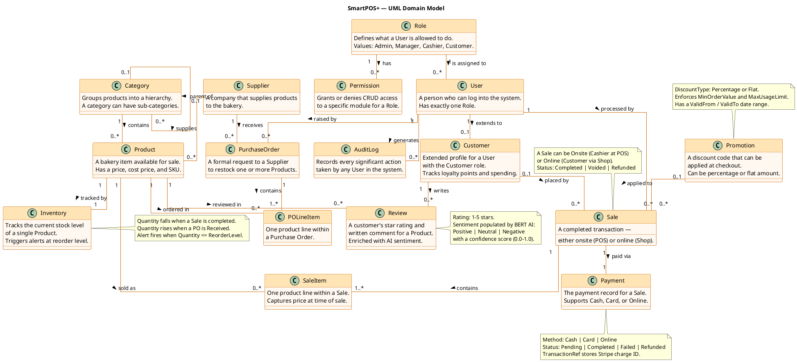
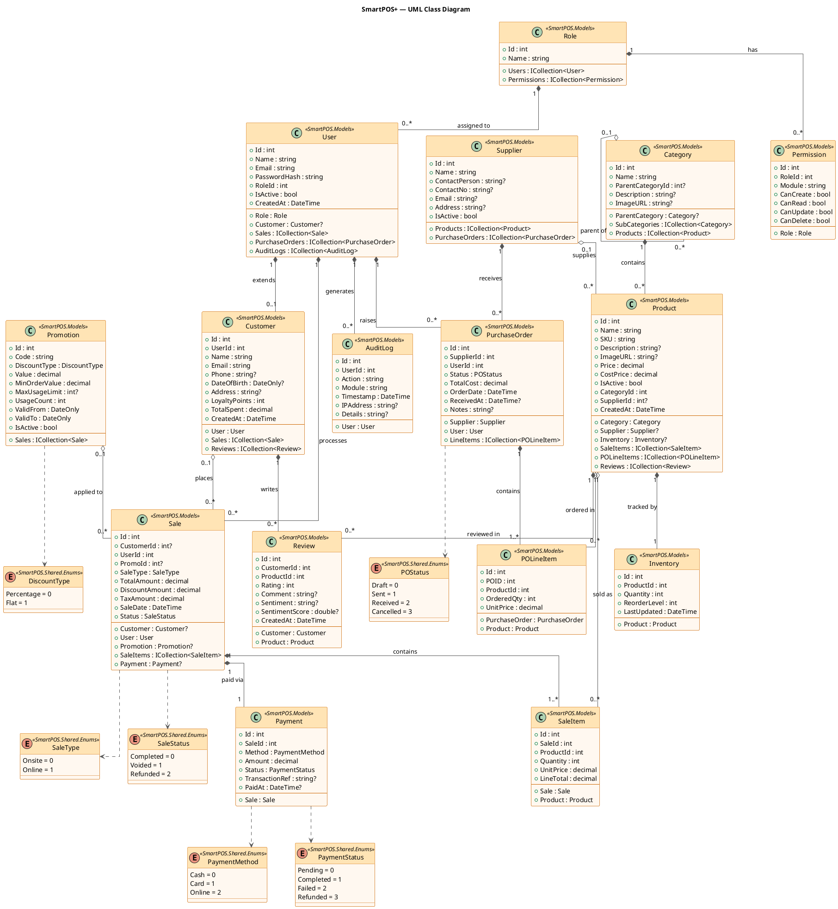
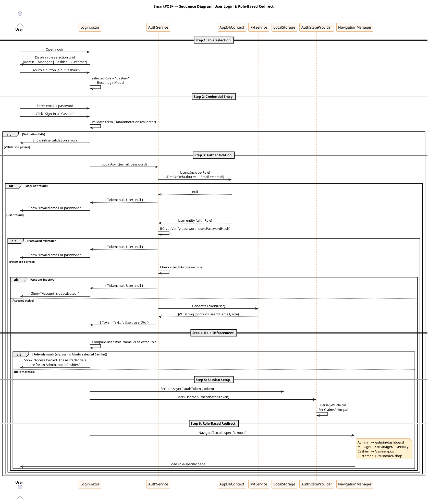
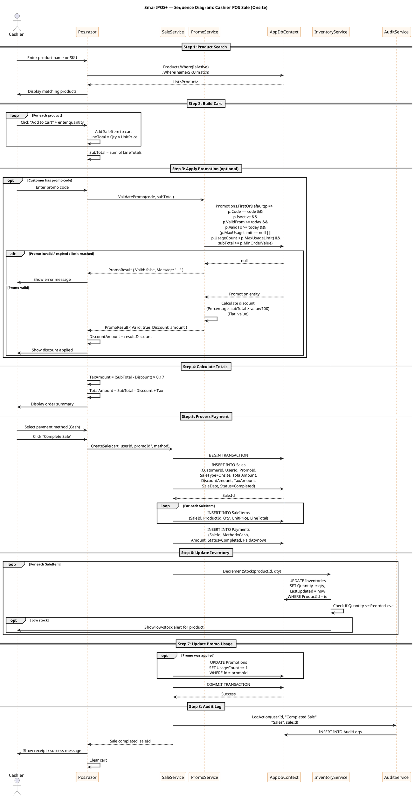
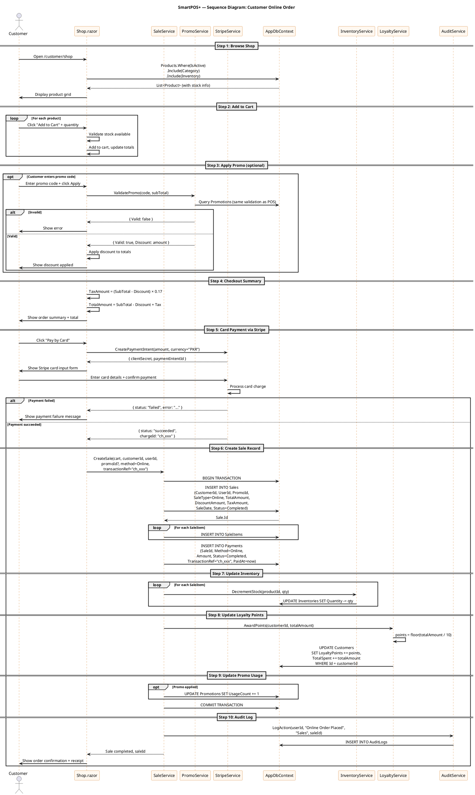
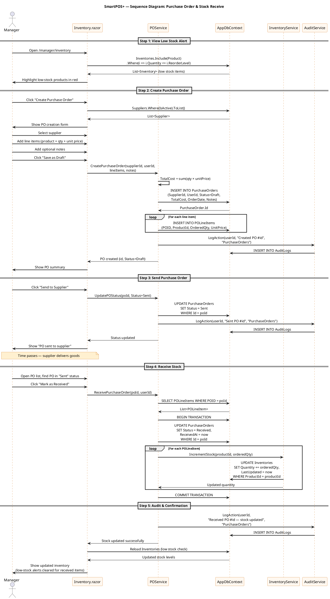
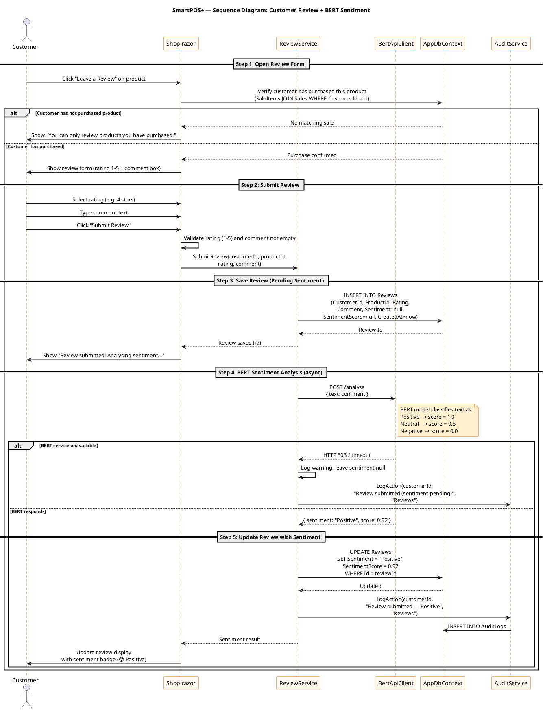

# SmartPOS+ — System Design Document

**Project:** SmartPOS+ Bakery Point-of-Sale System  
**Technology:** Blazor Server, .NET 10, EF Core, SQL Server (LocalDB)  
**Author:** Maryam Yaqoob  
**Version:** 1.0  

---

## Table of Contents

1. [Project Overview](#1-project-overview)
2. [Functional Requirements — User Stories](#2-functional-requirements--user-stories)
3. [Non-Functional Requirements](#3-non-functional-requirements)
4. [UML Use Case Diagram](#4-uml-use-case-diagram)
5. [UML Domain Model](#5-uml-domain-model)
6. [UML Class Diagram](#6-uml-class-diagram)
7. [Entity Relationship Diagram (ERD)](#7-entity-relationship-diagram-erd)
8. [Sequence Diagrams](#8-sequence-diagrams)

---

## 1. Project Overview

SmartPOS+ is a web-based Point-of-Sale system built for a bakery. It supports four distinct user roles — Admin, Manager, Cashier, and Customer — each with their own dedicated portal and permissions. The system handles product catalog management, inventory tracking, sales processing (both onsite and online), customer loyalty, promotions, purchase orders, payment processing, product reviews with AI sentiment analysis, and full audit logging.

### Key Modules

| Module | Description |
|--------|-------------|
| Authentication & RBAC | Role-based login, JWT tokens, role-specific dashboards |
| Product Catalog | Products, categories (hierarchical), suppliers |
| Inventory | Stock levels, reorder alerts, purchase orders |
| Sales & POS | Onsite cashier terminal, online customer shop |
| Promotions | Discount codes (percentage or flat), usage limits |
| Payments | Cash, card, online (Stripe) payment processing |
| Reviews | Customer ratings + BERT AI sentiment analysis |
| Audit Logging | Unified log of all user actions across all roles |
| Admin Panel | User management, permissions, system oversight |

---

## 2. Functional Requirements — User Stories

### 2.1 Authentication & User Management

**US-01**  
As a **user**, I want to select my role (Admin, Manager, Cashier, Customer) on the login screen, so that I am directed to the correct portal after signing in.

**US-02**  
As a **user**, I want to log in with my email and password, so that I can securely access my role-specific dashboard.

**US-03**  
As a **new customer**, I want to register an account by providing my name, email, and password, so that I can shop online and track my orders.

**US-04**  
As an **Admin**, I want to create, activate, and deactivate user accounts, so that I can control who has access to the system.

**US-05**  
As an **Admin**, I want to assign roles and module-level permissions (CanCreate, CanRead, CanUpdate, CanDelete) to each role, so that access is controlled at a granular level.

**US-06**  
As a **user**, I want to be redirected to my role-specific dashboard after login (Admin → /admin/dashboard, Manager → /manager/inventory, Cashier → /cashier/pos, Customer → /customer/shop), so that I immediately see the tools relevant to my role.

---

### 2.2 Product Catalog

**US-07**  
As a **Manager**, I want to add new products with a name, SKU, description, price, cost price, category, and supplier, so that they appear in the POS and customer shop.

**US-08**  
As a **Manager**, I want to edit and deactivate products, so that outdated or unavailable items are hidden from the POS and shop without being deleted.

**US-09**  
As a **Manager**, I want to organise products into hierarchical categories (e.g. Bakery > Cakes > Birthday Cakes), so that customers and cashiers can browse products easily.

**US-10**  
As a **Manager**, I want to assign a supplier to a product, so that I know where to reorder it from.

---

### 2.3 Inventory Management

**US-11**  
As a **Manager**, I want to view the current stock level of every product, so that I know what is available for sale.

**US-12**  
As a **Manager**, I want to set a reorder level for each product, so that I receive a low-stock alert when quantity falls to or below that threshold.

**US-13**  
As a **Manager**, I want to create a purchase order for a supplier listing the products and quantities needed, so that I can restock inventory.

**US-14**  
As a **Manager**, I want to update a purchase order status (Draft → Sent → Received → Cancelled), so that I can track the restock lifecycle.

**US-15**  
As a **Manager**, I want inventory quantities to update automatically when a purchase order is marked as Received, so that stock levels stay accurate.

---

### 2.4 Sales & POS Terminal

**US-16**  
As a **Cashier**, I want to search for products by name or SKU and add them to a cart, so that I can build a sale quickly at the counter.

**US-17**  
As a **Cashier**, I want to apply a promotion code to a sale, so that the discount is calculated and deducted from the total automatically.

**US-18**  
As a **Cashier**, I want to process payment (cash, card, or online) and complete the sale, so that a receipt is generated and inventory is decremented.

**US-19**  
As a **Cashier**, I want to void a completed sale, so that incorrect transactions can be reversed.

**US-20**  
As a **Customer**, I want to browse the online shop, add products to a cart, and place an order, so that I can buy bakery items without visiting the store.

**US-21**  
As a **Customer**, I want to apply a promotion code at checkout, so that I receive the applicable discount on my order.

**US-22**  
As a **system**, I want to calculate 17% GST on every sale automatically, so that tax is always correctly applied.

---

### 2.5 Promotions

**US-23**  
As a **Manager**, I want to create a promotion with a unique code, discount type (percentage or flat), value, minimum order value, usage limit, and validity dates, so that customers can redeem discounts at checkout.

**US-24**  
As a **Manager**, I want to activate and deactivate promotions, so that I can control which offers are currently available.

**US-25**  
As a **system**, I want to increment the usage count of a promotion each time it is successfully applied, so that usage limits are enforced.

---

### 2.6 Payments

**US-26**  
As a **Cashier**, I want to record a cash payment against a sale, so that the transaction is marked as completed.

**US-27**  
As a **Customer**, I want to pay online using a card (via Stripe), so that I can complete my purchase securely without cash.

**US-28**  
As a **system**, I want to store the Stripe transaction reference against a payment, so that card payments can be traced and refunded if needed.

**US-29**  
As a **Manager**, I want to process a refund on a completed sale, so that the customer is reimbursed and the sale status is updated to Refunded.

---

### 2.7 Customer Loyalty

**US-30**  
As a **Customer**, I want to earn loyalty points on every completed purchase, so that I am rewarded for repeat business.

**US-31**  
As a **Customer**, I want to view my total loyalty points and total amount spent, so that I can track my rewards.

---

### 2.8 Reviews & Sentiment Analysis

**US-32**  
As a **Customer**, I want to leave a star rating (1–5) and written review for a product I have purchased, so that I can share my feedback.

**US-33**  
As a **system**, I want to send the review text to a BERT AI service and store the sentiment result (Positive / Neutral / Negative) and confidence score, so that the business can analyse customer feedback at scale.

**US-34**  
As a **Manager**, I want to view the sentiment breakdown of reviews for each product, so that I can identify which products are well-received and which need attention.

---

### 2.9 Audit Logging

**US-35**  
As an **Admin**, I want every significant user action (create, update, delete, void, login) to be recorded in the audit log with the user, module, action, timestamp, and IP address, so that I have a full activity trail for compliance and security.

**US-36**  
As an **Admin**, I want to filter and search the audit log by user, module, date range, and action, so that I can investigate specific events quickly.

---

## 3. Non-Functional Requirements

### 3.1 Security

**NFR-01** — All passwords must be hashed using BCrypt before storage. Plain-text passwords must never be persisted.

**NFR-02** — Authentication must use JWT tokens stored in browser LocalStorage. Tokens must expire after a configurable period.

**NFR-03** — All pages must enforce role-based access control using `[Authorize(Roles = "...")]`. Unauthorised access attempts must redirect to the login page.

**NFR-04** — The connection string must never be hardcoded in source files. It must be read from `appsettings.json` via dependency injection.

**NFR-05** — All database queries must use parameterised EF Core LINQ queries to prevent SQL injection.

### 3.2 Performance

**NFR-06** — The POS terminal product search must return results within 500ms for a catalogue of up to 10,000 products.

**NFR-07** — The customer shop page must load within 2 seconds on a standard broadband connection.

**NFR-08** — Database queries must use indexed columns (Email, RoleId, SKU, SaleId, ProductId, UserId) to avoid full table scans.

### 3.3 Reliability & Data Integrity

**NFR-09** — All decimal monetary values must be stored with precision (10, 2) to prevent rounding errors.

**NFR-10** — The Review Rating column must enforce a CHECK constraint (`Rating >= 1 AND Rating <= 5`) at the database level.

**NFR-11** — Unique constraints must be enforced on User.Email, Customer.Email, Product.SKU, Promotion.Code, Supplier.Email, Inventory.ProductId, and Payment.SaleId.

**NFR-12** — Cascade delete must only be applied where logically correct (Sale → SaleItems, PurchaseOrder → POLineItems). Restrict must be used where history must be preserved (Product → SaleItems).

### 3.4 Usability

**NFR-13** — Each role must have a distinct layout and navigation menu so that users only see the features relevant to their role.

**NFR-14** — All forms must display inline validation messages using Blazor `DataAnnotationsValidator`.

**NFR-15** — The system must display a loading indicator during async operations (login, checkout, product search).

### 3.5 Maintainability

**NFR-16** — All EF Core model configuration must use Fluent API in `AppDbContext.OnModelCreating`. Data annotations on model classes must not be used for database configuration.

**NFR-17** — Shared enum types (`DiscountType`, `SaleType`, `SaleStatus`, `POStatus`, `PaymentMethod`, `PaymentStatus`) must be defined in a single `Contracts.cs` file under `SmartPOS.Shared.Enums`.

**NFR-18** — The application must follow the partial class pattern for all EF Core model classes to allow scaffolding without overwriting custom logic.

### 3.6 Scalability

**NFR-19** — The category system must support unlimited nesting depth via the self-referencing `ParentCategoryId` foreign key.

**NFR-20** — The audit log must be designed to handle high write volume without impacting read performance on other tables (separate table, indexed on UserId and Timestamp).

---

---

## 4. UML Use Case Diagram

```plantuml
@startuml SmartPOS_UseCaseDiagram

skinparam actorStyle awesome
skinparam packageStyle rectangle
skinparam usecase {
  BackgroundColor #FFF8F0
  BorderColor #CC6600
  ArrowColor #CC6600
}
skinparam actor {
  BackgroundColor #FFE4B5
  BorderColor #CC6600
}

title SmartPOS+ — UML Use Case Diagram

' ─────────────────────────────────────────
' ACTORS
' ─────────────────────────────────────────
actor Admin      as A #FFD700
actor Manager    as M #87CEEB
actor Cashier    as C #90EE90
actor Customer   as CU #FFB6C1
actor "BERT AI\nService" as BERT #D3D3D3
actor "Stripe\nPayment" as STRIPE #D3D3D3

' ─────────────────────────────────────────
' SYSTEM BOUNDARY
' ─────────────────────────────────────────
rectangle "SmartPOS+ System" {

  ' ── AUTHENTICATION ──────────────────────
  package "Authentication" {
    usecase "Select Role"            as UC01
    usecase "Login"                  as UC02
    usecase "Register Account"       as UC03
    usecase "Logout"                 as UC04
  }

  ' ── USER & PERMISSION MANAGEMENT ────────
  package "User & Permission Management" {
    usecase "Manage Users\n(Create/Activate/Deactivate)" as UC05
    usecase "Assign Role Permissions"                    as UC06
    usecase "View Audit Log"                             as UC07
  }

  ' ── PRODUCT CATALOG ─────────────────────
  package "Product Catalog" {
    usecase "Add / Edit Product"         as UC08
    usecase "Deactivate Product"         as UC09
    usecase "Manage Categories"          as UC10
    usecase "Manage Suppliers"           as UC11
  }

  ' ── INVENTORY ───────────────────────────
  package "Inventory Management" {
    usecase "View Stock Levels"          as UC12
    usecase "Set Reorder Level"          as UC13
    usecase "Create Purchase Order"      as UC14
    usecase "Update PO Status"           as UC15
    usecase "Receive Stock"              as UC16
  }

  ' ── SALES & POS ─────────────────────────
  package "Sales & POS" {
    usecase "Search Products"            as UC17
    usecase "Add Item to Cart"           as UC18
    usecase "Apply Promotion Code"       as UC19
    usecase "Process Payment"            as UC20
    usecase "Complete Sale"              as UC21
    usecase "Void Sale"                  as UC22
    usecase "Browse Online Shop"         as UC23
    usecase "Place Online Order"         as UC24
  }

  ' ── PROMOTIONS ──────────────────────────
  package "Promotions" {
    usecase "Create / Edit Promotion"    as UC25
    usecase "Activate / Deactivate Promo" as UC26
  }

  ' ── PAYMENTS ────────────────────────────
  package "Payments" {
    usecase "Pay by Cash"                as UC27
    usecase "Pay by Card (Stripe)"       as UC28
    usecase "Process Refund"             as UC29
  }

  ' ── REVIEWS ─────────────────────────────
  package "Reviews & Sentiment" {
    usecase "Submit Product Review"      as UC30
    usecase "Analyse Sentiment (BERT)"   as UC31
    usecase "View Sentiment Report"      as UC32
  }

  ' ── LOYALTY ─────────────────────────────
  package "Customer Loyalty" {
    usecase "Earn Loyalty Points"        as UC33
    usecase "View Loyalty Balance"       as UC34
  }

}

' ─────────────────────────────────────────
' ACTOR → USE CASE ASSOCIATIONS
' ─────────────────────────────────────────

' All actors share authentication
A  --> UC01
M  --> UC01
C  --> UC01
CU --> UC01

A  --> UC02
M  --> UC02
C  --> UC02
CU --> UC02

CU --> UC03
A  --> UC04
M  --> UC04
C  --> UC04
CU --> UC04

' Admin
A --> UC05
A --> UC06
A --> UC07
A --> UC08
A --> UC09
A --> UC10
A --> UC11
A --> UC12
A --> UC17
A --> UC22
A --> UC25
A --> UC26
A --> UC29

' Manager
M --> UC08
M --> UC09
M --> UC10
M --> UC11
M --> UC12
M --> UC13
M --> UC14
M --> UC15
M --> UC16
M --> UC25
M --> UC26
M --> UC29
M --> UC32

' Cashier
C --> UC17
C --> UC18
C --> UC19
C --> UC20
C --> UC21
C --> UC22
C --> UC27

' Customer
CU --> UC23
CU --> UC24
CU --> UC19
CU --> UC28
CU --> UC30
CU --> UC33
CU --> UC34

' External systems
STRIPE --> UC28
BERT   --> UC31

' ─────────────────────────────────────────
' INCLUDE / EXTEND RELATIONSHIPS
' ─────────────────────────────────────────
UC21 .> UC20 : <<include>>
UC21 .> UC33 : <<include>>
UC24 .> UC20 : <<include>>
UC24 .> UC33 : <<include>>
UC20 .> UC27 : <<extend>>
UC20 .> UC28 : <<extend>>
UC19 .> UC21 : <<extend>>
UC30 .> UC31 : <<include>>
UC16 .> UC12 : <<include>>

@enduml
```

### Use Case Summary Table

| Use Case | Actor(s) | Description |
|----------|----------|-------------|
| UC01 Select Role | All | Choose Admin/Manager/Cashier/Customer before login |
| UC02 Login | All | Authenticate with email + password |
| UC03 Register | Customer | Self-register as a new customer |
| UC04 Logout | All | End session and clear JWT token |
| UC05 Manage Users | Admin | Create, activate, deactivate user accounts |
| UC06 Assign Permissions | Admin | Set per-role, per-module CRUD rights |
| UC07 View Audit Log | Admin | Search and filter all system activity |
| UC08 Add/Edit Product | Admin, Manager | Manage product catalog entries |
| UC09 Deactivate Product | Admin, Manager | Hide product from POS and shop |
| UC10 Manage Categories | Admin, Manager | Create hierarchical product categories |
| UC11 Manage Suppliers | Admin, Manager | Maintain supplier contact records |
| UC12 View Stock Levels | Admin, Manager | See current inventory quantities |
| UC13 Set Reorder Level | Manager | Configure low-stock alert threshold |
| UC14 Create Purchase Order | Manager | Raise a PO to restock from supplier |
| UC15 Update PO Status | Manager | Move PO through Draft→Sent→Received→Cancelled |
| UC16 Receive Stock | Manager | Mark PO received and update inventory |
| UC17 Search Products | Admin, Cashier | Find products by name or SKU |
| UC18 Add Item to Cart | Cashier | Build a sale at the POS terminal |
| UC19 Apply Promo Code | Cashier, Customer | Validate and apply a discount code |
| UC20 Process Payment | Cashier, Customer | Collect payment for a sale |
| UC21 Complete Sale | Cashier | Finalise sale, generate receipt |
| UC22 Void Sale | Admin, Cashier | Reverse a completed transaction |
| UC23 Browse Online Shop | Customer | View active products in the shop |
| UC24 Place Online Order | Customer | Submit an online sale |
| UC25 Create/Edit Promotion | Admin, Manager | Define discount codes and rules |
| UC26 Activate/Deactivate Promo | Admin, Manager | Toggle promotion availability |
| UC27 Pay by Cash | Cashier | Record a cash payment |
| UC28 Pay by Card | Customer | Process Stripe card payment |
| UC29 Process Refund | Admin, Manager | Refund a completed sale |
| UC30 Submit Review | Customer | Rate and review a product |
| UC31 Analyse Sentiment | BERT AI | Auto-classify review text |
| UC32 View Sentiment Report | Manager | See AI sentiment breakdown per product |
| UC33 Earn Loyalty Points | Customer | Accumulate points on purchase |
| UC34 View Loyalty Balance | Customer | Check points and total spent |

---

---

## 5. UML Domain Model

The Domain Model shows the key business concepts and their relationships using plain language — no implementation details, no data types, no methods. It captures **what the business cares about**.

### Domain Concept Descriptions

| Concept | Business Meaning |
|---------|-----------------|
| **User** | Anyone who logs into SmartPOS+. Every user has exactly one role. |
| **Role** | Defines the type of user — Admin, Manager, Cashier, or Customer. |
| **Permission** | A per-role, per-module access rule (CanCreate, CanRead, CanUpdate, CanDelete). |
| **Customer** | An extended profile for users with the Customer role. Stores loyalty points, total spent, phone, address, and date of birth. |
| **AuditLog** | A tamper-evident record of every significant action in the system — who did what, when, from where. |
| **Product** | A bakery item with a selling price, cost price, SKU, and category. Can be active or inactive. |
| **Category** | A named group for products. Categories can be nested (e.g. Bakery > Cakes > Birthday Cakes). |
| **Supplier** | A company that provides products to the bakery. Linked to products and purchase orders. |
| **Inventory** | One stock record per product. Tracks current quantity and the reorder threshold. |
| **PurchaseOrder** | A formal restock request sent to a supplier. Goes through Draft → Sent → Received → Cancelled. |
| **POLineItem** | A single product line within a purchase order, with quantity and agreed unit price. |
| **Sale** | A transaction — either onsite at the POS terminal or online via the customer shop. |
| **SaleItem** | A single product line within a sale. Stores the price at the time of sale (not the current price). |
| **Promotion** | A discount code with rules: type (percentage/flat), value, minimum order, usage limit, and validity dates. |
| **Payment** | The payment record attached to a sale. One payment per sale. Supports cash, card, and online. |
| **Review** | A customer's rating and comment for a product, enriched with BERT AI sentiment analysis. |

### Key Domain Rules

1. Every **User** has exactly one **Role**.
2. Every **Product** has exactly one **Inventory** record.
3. Every **Sale** has exactly one **Payment** record.
4. A **Customer** profile exists only for users with the Customer role.
5. A **Sale** can exist without a **Customer** (guest checkout at POS).
6. A **SaleItem** stores the price at the time of sale — changing a product's price later does not affect historical sales.
7. A **Category** can be a parent of other categories (unlimited depth).
8. A **Promotion** can be applied to many sales but tracks its total usage count.
9. Deleting a **Supplier** sets `SupplierId` to null on linked products — products are not deleted.
10. Deleting a **Category** is blocked if it has linked products (Restrict).

---

---

## 6. UML Class Diagram

The Class Diagram shows the actual C# model classes with their properties, data types, and navigation relationships — directly reflecting the EF Core models in `SmartPOS/Models/`.

### Class Diagram — Relationship Legend

| Symbol | Meaning |
|--------|---------|
| `*--` (filled diamond) | Composition — child cannot exist without parent |
| `o--` (open diamond) | Aggregation — child can exist independently |
| `..>` (dashed arrow) | Dependency — class uses an enum type |
| `"1"` / `"0..*"` | Multiplicity on each end of the relationship |

### Composition vs Aggregation Decisions

| Relationship | Type | Reason |
|---|---|---|
| Role → Permission | Composition | Permissions have no meaning without a Role |
| Role → User | Composition | Users must have a Role |
| User → Customer | Composition | Customer profile is part of the User |
| User → AuditLog | Composition | Logs belong to the User who created them |
| Category → Product | Composition | Products must belong to a Category |
| Product → Inventory | Composition | Inventory record is part of the Product |
| PurchaseOrder → POLineItem | Composition | Line items have no meaning without the PO |
| Sale → SaleItem | Composition | Line items have no meaning without the Sale |
| Sale → Payment | Composition | Payment is part of the Sale |
| Customer → Review | Composition | Reviews belong to the Customer |
| Product → Review | Composition | Reviews belong to the Product |
| Supplier → Product | Aggregation | Products survive if Supplier is deleted (SetNull) |
| Supplier → PurchaseOrder | Aggregation | POs reference Supplier but are independent records |
| Promotion → Sale | Aggregation | Sales survive if Promotion is removed |
| Product → SaleItem | Aggregation | Historical sale items survive if Product is deactivated |
| Product → POLineItem | Aggregation | PO history survives independently |

---

---

## 7. Entity Relationship Diagram (ERD)

The ERD shows the actual database tables, columns, data types, primary keys, foreign keys, unique constraints, and delete behaviors — directly reflecting the `FullDatabaseSetup` migration.

```plantuml
@startuml SmartPOS_ERD

skinparam linetype ortho
skinparam nodesep 50
skinparam ranksep 70
skinparam classBackgroundColor #FFFDF5
skinparam classBorderColor #8B4513
skinparam classHeaderBackgroundColor #F4A460
skinparam arrowColor #8B4513

title SmartPOS+ — Entity Relationship Diagram (ERD)

' ─────────────────────────────────────────
' TABLE: Roles
' ─────────────────────────────────────────
entity "Roles" as Roles {
  * Id : INT <<PK, IDENTITY>>
  --
  * Name : NVARCHAR(50) NOT NULL
}

' ─────────────────────────────────────────
' TABLE: Permissions
' ─────────────────────────────────────────
entity "Permissions" as Permissions {
  * Id : INT <<PK, IDENTITY>>
  --
  * RoleId : INT <<FK → Roles.Id>> <<IDX>>
  * Module : NVARCHAR(100) NOT NULL
  * CanCreate : BIT DEFAULT 0
  * CanRead : BIT DEFAULT 0
  * CanUpdate : BIT DEFAULT 0
  * CanDelete : BIT DEFAULT 0
}

' ─────────────────────────────────────────
' TABLE: Users
' ─────────────────────────────────────────
entity "Users" as Users {
  * Id : INT <<PK, IDENTITY>>
  --
  * Name : NVARCHAR(100) NOT NULL
  * Email : NVARCHAR(150) NOT NULL <<UQ>>
  * PasswordHash : NVARCHAR(255) NOT NULL
  * RoleId : INT <<FK → Roles.Id>> <<IDX>>
  * IsActive : BIT DEFAULT 1
  * CreatedAt : DATETIME2 DEFAULT getutcdate()
}

' ─────────────────────────────────────────
' TABLE: Customers
' ─────────────────────────────────────────
entity "Customers" as Customers {
  * Id : INT <<PK, IDENTITY>>
  --
  * UserId : INT <<FK → Users.Id>> <<UQ>>
  * Name : NVARCHAR(100) NOT NULL
  * Email : NVARCHAR(150) NOT NULL <<UQ>>
  Phone : NVARCHAR(20) NULL
  DateOfBirth : DATE NULL
  Address : TEXT NULL
  * LoyaltyPoints : INT DEFAULT 0
  * TotalSpent : DECIMAL(10,2) DEFAULT 0.00
  * CreatedAt : DATETIME2 DEFAULT getutcdate()
}

' ─────────────────────────────────────────
' TABLE: AuditLogs
' ─────────────────────────────────────────
entity "AuditLogs" as AuditLogs {
  * Id : INT <<PK, IDENTITY>>
  --
  * UserId : INT <<FK → Users.Id>> <<IDX>>
  * Action : NVARCHAR(255) NOT NULL
  * Module : NVARCHAR(100) NOT NULL
  * Timestamp : DATETIME2 DEFAULT getutcdate()
  IPAddress : NVARCHAR(45) NULL
  Details : TEXT NULL
}

' ─────────────────────────────────────────
' TABLE: Categories
' ─────────────────────────────────────────
entity "Categories" as Categories {
  * Id : INT <<PK, IDENTITY>>
  --
  * Name : NVARCHAR(100) NOT NULL
  ParentCategoryId : INT <<FK → Categories.Id, NO ACTION>> NULL
  Description : TEXT NULL
  ImageURL : NVARCHAR(255) NULL
}

' ─────────────────────────────────────────
' TABLE: Suppliers
' ─────────────────────────────────────────
entity "Suppliers" as Suppliers {
  * Id : INT <<PK, IDENTITY>>
  --
  * Name : NVARCHAR(100) NOT NULL
  ContactPerson : NVARCHAR(100) NULL
  ContactNo : NVARCHAR(20) NULL
  Email : NVARCHAR(150) NULL <<UQ>>
  Address : TEXT NULL
  * IsActive : BIT DEFAULT 1
}

' ─────────────────────────────────────────
' TABLE: Products
' ─────────────────────────────────────────
entity "Products" as Products {
  * Id : INT <<PK, IDENTITY>>
  --
  * Name : NVARCHAR(150) NOT NULL
  * SKU : NVARCHAR(50) NOT NULL <<UQ>>
  Description : TEXT NULL
  ImageURL : NVARCHAR(255) NULL
  * Price : DECIMAL(10,2) NOT NULL
  * CostPrice : DECIMAL(10,2) NOT NULL
  * IsActive : BIT DEFAULT 1
  * CategoryId : INT <<FK → Categories.Id, RESTRICT>>
  SupplierId : INT <<FK → Suppliers.Id, SET NULL>> NULL
  * CreatedAt : DATETIME2 DEFAULT getutcdate()
}

' ─────────────────────────────────────────
' TABLE: Inventories
' ─────────────────────────────────────────
entity "Inventories" as Inventories {
  * Id : INT <<PK, IDENTITY>>
  --
  * ProductId : INT <<FK → Products.Id>> <<UQ>>
  * Quantity : INT DEFAULT 0
  * ReorderLevel : INT NOT NULL
  * LastUpdated : DATETIME2 DEFAULT getutcdate()
}

' ─────────────────────────────────────────
' TABLE: Promotions
' ─────────────────────────────────────────
entity "Promotions" as Promotions {
  * Id : INT <<PK, IDENTITY>>
  --
  * Code : NVARCHAR(50) NOT NULL <<UQ>>
  * DiscountType : INT NOT NULL
  * Value : DECIMAL(10,2) NOT NULL
  * MinOrderValue : DECIMAL(10,2) DEFAULT 0.00
  MaxUsageLimit : INT NULL
  * UsageCount : INT DEFAULT 0
  * ValidFrom : DATE NOT NULL
  * ValidTo : DATE NOT NULL
  * IsActive : BIT DEFAULT 1
}

' ─────────────────────────────────────────
' TABLE: PurchaseOrders
' ─────────────────────────────────────────
entity "PurchaseOrders" as PurchaseOrders {
  * Id : INT <<PK, IDENTITY>>
  --
  * SupplierId : INT <<FK → Suppliers.Id>>
  * UserId : INT <<FK → Users.Id>>
  * Status : INT DEFAULT 0
  * TotalCost : DECIMAL(10,2) NOT NULL
  * OrderDate : DATETIME2 DEFAULT getutcdate()
  ReceivedAt : DATETIME2 NULL
  Notes : TEXT NULL
}

' ─────────────────────────────────────────
' TABLE: POLineItems
' ─────────────────────────────────────────
entity "POLineItems" as POLineItems {
  * Id : INT <<PK, IDENTITY>>
  --
  * POID : INT <<FK → PurchaseOrders.Id, CASCADE>> <<IDX>>
  * ProductId : INT <<FK → Products.Id>>
  * OrderedQty : INT NOT NULL
  * UnitPrice : DECIMAL(10,2) NOT NULL
}

' ─────────────────────────────────────────
' TABLE: Sales
' ─────────────────────────────────────────
entity "Sales" as Sales {
  * Id : INT <<PK, IDENTITY>>
  --
  CustomerId : INT <<FK → Customers.Id>> NULL
  * UserId : INT <<FK → Users.Id>>
  PromoId : INT <<FK → Promotions.Id>> NULL
  * SaleType : INT NOT NULL
  * TotalAmount : DECIMAL(10,2) NOT NULL
  * DiscountAmount : DECIMAL(10,2) DEFAULT 0.00
  * TaxAmount : DECIMAL(10,2) NOT NULL
  * SaleDate : DATETIME2 DEFAULT getutcdate()
  * Status : INT DEFAULT 0
}

' ─────────────────────────────────────────
' TABLE: SaleItems
' ─────────────────────────────────────────
entity "SaleItems" as SaleItems {
  * Id : INT <<PK, IDENTITY>>
  --
  * SaleId : INT <<FK → Sales.Id, CASCADE>> <<IDX>>
  * ProductId : INT <<FK → Products.Id, RESTRICT>>
  * Quantity : INT NOT NULL
  * UnitPrice : DECIMAL(10,2) NOT NULL
  * LineTotal : DECIMAL(10,2) NOT NULL
}

' ─────────────────────────────────────────
' TABLE: Reviews
' ─────────────────────────────────────────
entity "Reviews" as Reviews {
  * Id : INT <<PK, IDENTITY>>
  --
  * CustomerId : INT <<FK → Customers.Id>>
  * ProductId : INT <<FK → Products.Id>>
  * Rating : INT NOT NULL <<CHECK: 1-5>>
  Comment : TEXT NULL
  Sentiment : NVARCHAR(20) NULL
  SentimentScore : FLOAT NULL
  * CreatedAt : DATETIME2 DEFAULT getutcdate()
}

' ─────────────────────────────────────────
' TABLE: Payments
' ─────────────────────────────────────────
entity "Payments" as Payments {
  * Id : INT <<PK, IDENTITY>>
  --
  * SaleId : INT <<FK → Sales.Id>> <<UQ>>
  * Method : INT NOT NULL
  * Amount : DECIMAL(10,2) NOT NULL
  * Status : INT DEFAULT 0
  TransactionRef : NVARCHAR(255) NULL
  PaidAt : DATETIME2 NULL
}

' ─────────────────────────────────────────
' FOREIGN KEY RELATIONSHIPS
' ─────────────────────────────────────────

' Access Control
Roles        ||--o{ Permissions     : "RoleId"
Roles        ||--o{ Users           : "RoleId"

' User extensions
Users        ||--|| Customers       : "UserId (1:1)"
Users        ||--o{ AuditLogs       : "UserId"
Users        ||--o{ Sales           : "UserId"
Users        ||--o{ PurchaseOrders  : "UserId"

' Product catalog
Categories   |o--o{ Categories      : "ParentCategoryId (self-ref)"
Categories   ||--o{ Products        : "CategoryId (RESTRICT)"
Suppliers    |o--o{ Products        : "SupplierId (SET NULL)"
Suppliers    ||--o{ PurchaseOrders  : "SupplierId"

' Inventory
Products     ||--|| Inventories     : "ProductId (1:1)"

' Purchase Orders
PurchaseOrders ||--o{ POLineItems   : "POID (CASCADE)"
Products       ||--o{ POLineItems   : "ProductId"

' Sales
Customers    |o--o{ Sales           : "CustomerId (nullable)"
Promotions   |o--o{ Sales           : "PromoId (nullable)"
Sales        ||--o{ SaleItems       : "SaleId (CASCADE)"
Products     ||--o{ SaleItems       : "ProductId (RESTRICT)"
Sales        ||--|| Payments        : "SaleId (1:1)"

' Reviews
Customers    ||--o{ Reviews         : "CustomerId"
Products     ||--o{ Reviews         : "ProductId"

@enduml
```

### ERD — Constraints & Delete Behaviors Summary

| Table | Column | Constraint | Delete Behavior |
|-------|--------|-----------|----------------|
| Users | Email | UNIQUE | — |
| Customers | UserId | UNIQUE (1:1 with Users) | Cascade |
| Customers | Email | UNIQUE | — |
| Products | SKU | UNIQUE | — |
| Products | CategoryId | NOT NULL | **Restrict** — cannot delete Category with Products |
| Products | SupplierId | NULLABLE | **SetNull** — Supplier deleted → SupplierId = NULL |
| Inventories | ProductId | UNIQUE (1:1 with Products) | Cascade |
| Promotions | Code | UNIQUE | — |
| Suppliers | Email | UNIQUE (nullable) | — |
| Categories | ParentCategoryId | NULLABLE (self-ref) | **NoAction** — prevents cascade cycles |
| Sales | CustomerId | NULLABLE | No action (guest checkout) |
| Sales | PromoId | NULLABLE | No action |
| SaleItems | SaleId | INDEX | **Cascade** — delete Sale removes its items |
| SaleItems | ProductId | NOT NULL | **Restrict** — cannot delete Product with sale history |
| PurchaseOrders | POID | INDEX | **Cascade** — delete PO removes its line items |
| Payments | SaleId | UNIQUE (1:1 with Sales) | Cascade |
| Reviews | Rating | CHECK (1–5) | — |

### ERD — Crow's Foot Notation Key

| Symbol | Meaning |
|--------|---------|
| `\|\|` | Exactly one (mandatory) |
| `\|o` | Zero or one (optional) |
| `o{` | Zero or many |
| `\|{` | One or many |

---

---

## 8. Sequence Diagrams

Four critical system flows are documented below.

---

### 8.1 Sequence Diagram — User Login & Role-Based Redirect

This diagram shows what happens from the moment a user selects their role and submits credentials to when they land on their dashboard.

---

### 8.2 Sequence Diagram — Cashier POS Sale (Onsite)

This diagram shows a cashier processing a sale at the POS terminal — from product search through payment to inventory update.

---

### 8.3 Sequence Diagram — Customer Online Order

This diagram shows a customer placing an order through the online shop with card payment via Stripe.

---

### 8.4 Sequence Diagram — Manager Purchase Order & Stock Receive

This diagram shows a manager creating a purchase order and then receiving the stock to update inventory.

---

### 8.5 Sequence Diagram — Customer Submits Review with BERT Sentiment

---

### Sequence Diagram Summary

| Diagram | Actors | Key Steps |
|---------|--------|-----------|
| **8.1 Login** | User, Login.razor, AuthService, JWT, LocalStorage, AuthStateProvider | Role select → credential validation → BCrypt verify → JWT issue → role-match check → redirect |
| **8.2 POS Sale** | Cashier, Pos.razor, SaleService, PromoService, DB, InventoryService | Product search → cart build → promo apply → tax calc → payment → inventory decrement → audit |
| **8.3 Online Order** | Customer, Shop.razor, SaleService, Stripe, DB, LoyaltyService | Browse → cart → promo → Stripe charge → sale record → inventory → loyalty points → audit |
| **8.4 Purchase Order** | Manager, Inventory.razor, POService, DB, InventoryService | Low-stock view → PO create → send → receive → stock increment → audit |
| **8.5 Review + BERT** | Customer, Shop.razor, ReviewService, BERT API, DB | Purchase verify → review save → BERT async call → sentiment update → audit |

---
